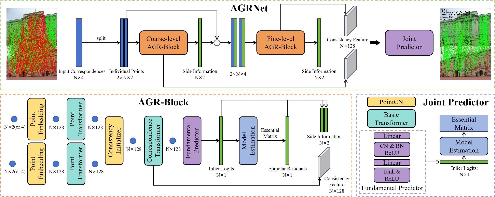
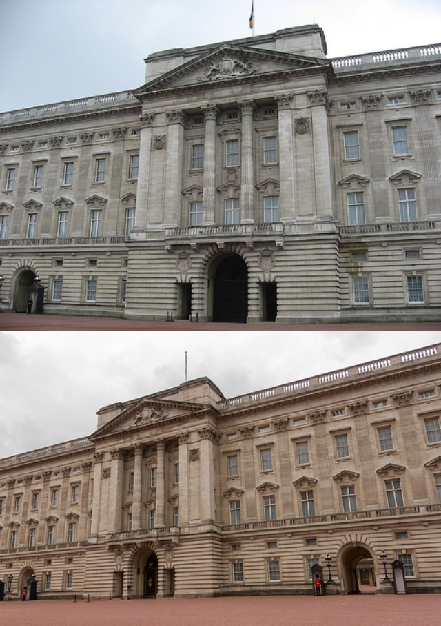
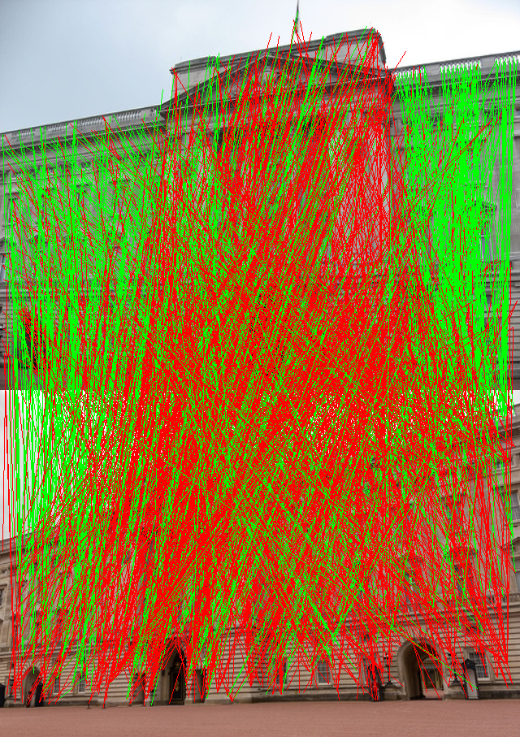
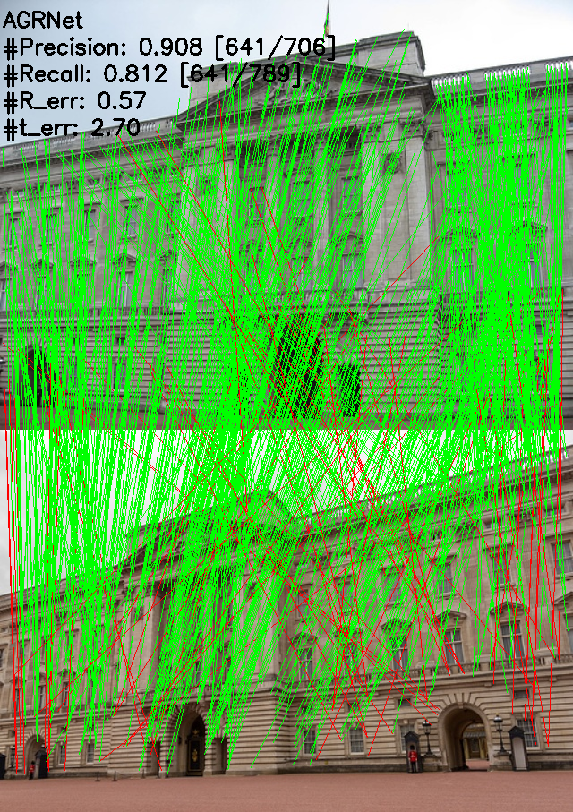
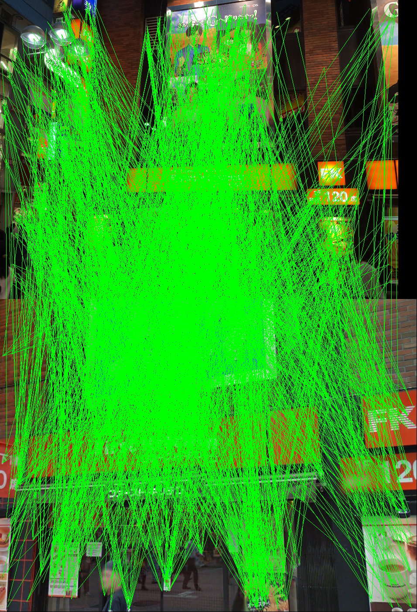
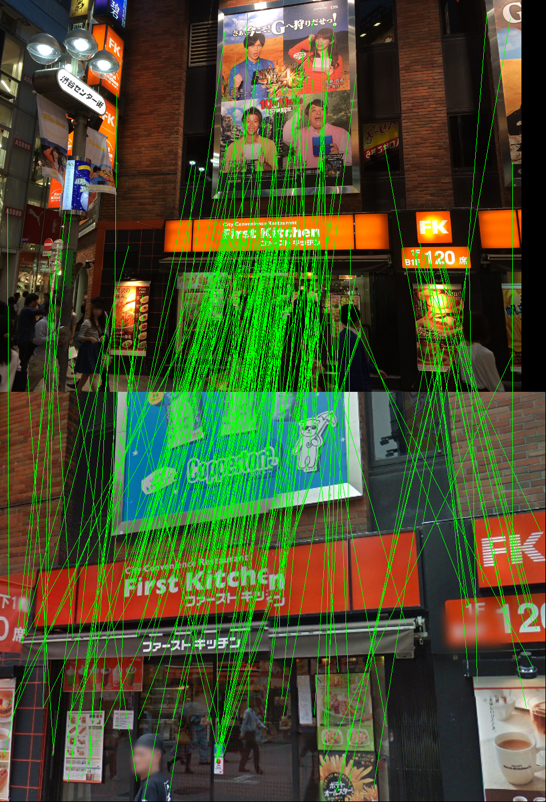
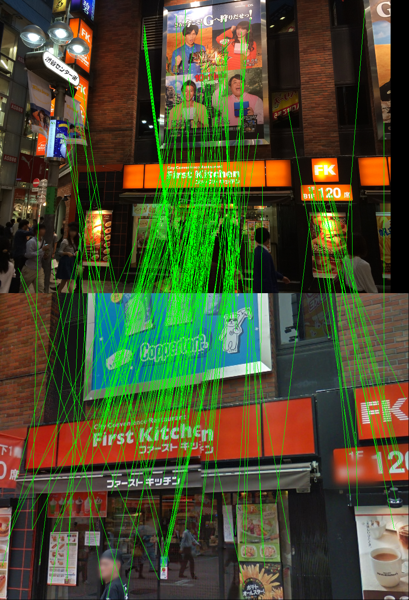

# AGRNet
Code for "Mining Global Relativity Consistency without Neighborhood Modeling for Correspondence Pruning"



## Requirements
You can pip with our provided enviornment.yaml.
```shell
conda env create -f environment.yaml
conda activate AGRNet
```

## Data preparation
This part is borrowed from [NCMNet](https://github.com/xinliu29/NCMNet#preparing-data). Please follow their instructions to download the training and testing data first.
```shell
bash download_data.sh raw_data raw_data_yfcc.tar.gz 0 8 ## YFCC100M
tar -xvf raw_data_yfcc.tar.gz

bash download_data.sh raw_sun3d_test raw_sun3d_test.tar.gz 0 2 ## SUN3D
tar -xvf raw_sun3d_test.tar.gz
bash download_data.sh raw_sun3d_train raw_sun3d_train.tar.gz 0 63
tar -xvf raw_sun3d_train.tar.gz
```

After downloading the datasets, the initial matches for YFCC100M and SUN3D can be generated as following. Descriptors for SIFT (default), ORB, and SuperPoint are provided. Please specify `--suffix` in extract_feature.py and `--desc_name` in yfcc.py (or sun3d.py) to change the descriptor. 
```shell
cd dump_match
python extract_feature.py --suffix sift-2000
python yfcc.py --desc_name sift-2000
python extract_feature.py --input_path=../raw_data/sun3d_test
python sun3d.py --desc_name sift-2000
```

## Reproduce
The pretrained models of outdoor and indoor scenes will be provided soon.

### Testing
Run the test scripts to get results in our paper.
```shell
cd ./core
```

#### Outdoor scenes
```shell
python main.py --run_mode=test --model_path=../model/yfcc --res_path=../model/yfcc --use_ransac=False
```

#### Indoor scenes
```shell
python main.py --run_mode=test --data_te=../data_dump/sun3d-sift-2000-test.hdf5 --model_path=../model/sun3d --res_path=../model/sun3d --use_ransac=False
```
You can set `--use_ransac=True` to get results after RANSAC post-processing.

### Training
Run the training scripts to retrain models of outdoor and indoor scenes.
```shell
cd ./core
```

#### Outdoor scenes
```shell
python main.py
```

#### Indoor scenes
```shell
python main.py --data_tr ../data_dump/sun3d-sift-2000-train.hdf5 --data_va ../data_dump/sun3d-sift-2000-test.hdf5
```

## Demos
### Demo on datasets
We provide some pair infomation in `assets` directory. Based on these assets, we provide a demo on YFCC100M or SUN3D. It generates initial image pair, initial matching, and inliers inferred by AGRNet. The precision, recall, and degree errors of rotation and translation will be annotated on the top left. You can specify `line 150` for scenes, `line 160` for model weights, and `line 147` for the index of image pair in this scene.
```shell
python demo_datasets.py
```
Here is an example of output.





### Demo on a single pair of unknown images
You can also generate inliers inferred by AGRNet on a singel pair of unknown images. You can specify `line 77` and `line 78` for image paths, and `line 79` for model weights.
```shell
python demo_datasets.py
```
Here is an example of output. The initial matching, output by coarse-level AGR-Block, output by fine-level AGR-Block, and output by joint predictor (final predictions) will be generated, respectively.






## Acknowledgements
This repository was developed from [OANet](https://github.com/zjhthu/OANet) and [NCMNet](https://github.com/xinliu29/NCMNet), and we are grateful for their implementations.

If you find this code useful for your research, please use the following BibTeX entry.
